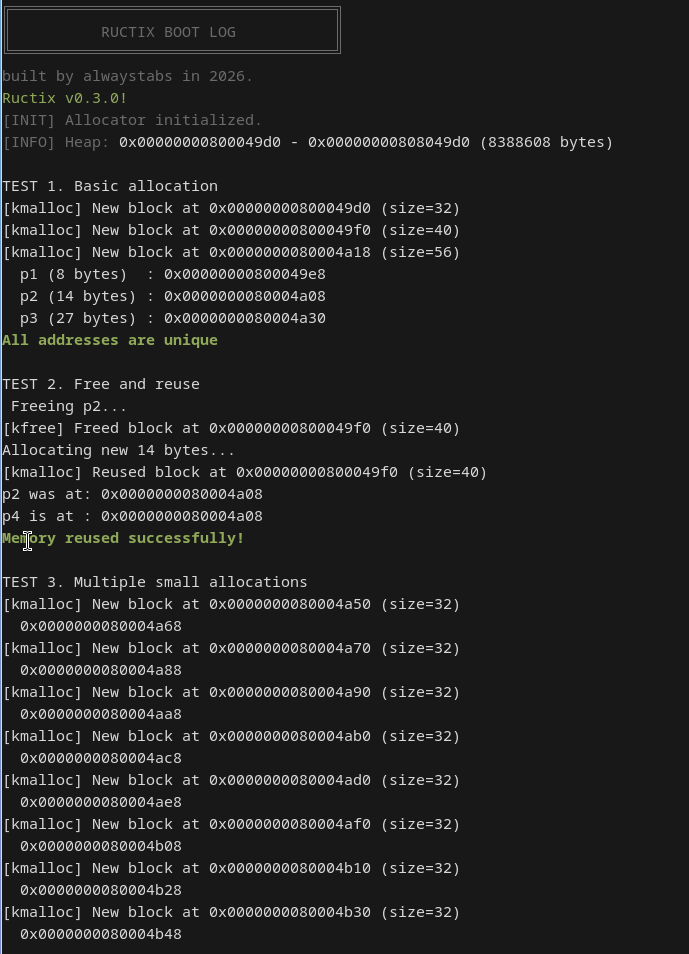
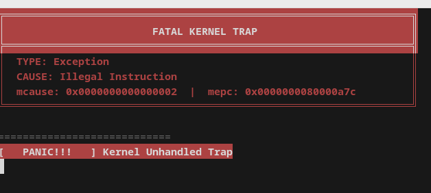
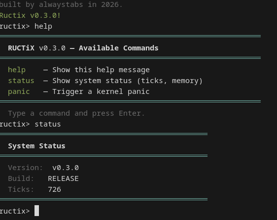

# RUCTiX

**A minimal RISC-V kernel built from scratch.**

[](LICENSE)

> ⚠️ **Educational project.** Not production-ready. See [Disclaimer](#disclaimer).

---

## Overview

Ructix is a minimal monolithic kernel targeting the RISC-V architecture
(RV64, **Machine mode**), written in C and RISC-V assembly. It is built
from scratch — no OpenSBI, no firmware, no libc — with the goal of
understanding low-level system programming: boot flow, trap handling,
memory management, and hardware interaction.

The kernel boots directly into M-mode on QEMU `virt` and provides an
interactive serial shell.

**Author's note:** this project is being written by a 14-year-old
developer who wanted to know how kernels actually work. It has come a
long way from "print a character over UART" to a block-based allocator,
fault injection, and an emergency stack — but it is still a learning
project, not an operating system you would run in production.

## Screenshots 








---

## Disclaimer

**Ructix is a strictly educational project.**

It is **not** production-ready and must **not** be used in any real-world,
commercial, or mission-critical environment. Specifically:

- No stability guarantees. APIs and behavior may change without notice.
- No security audits have been performed.
- No support for real hardware — QEMU `virt` only.
- No warranty of any kind, express or implied.

The project exists to study operating system design and the RISC-V
privileged architecture. Readers are encouraged to use it as a learning
reference, not as a foundation for deployed systems.

If you require a production RISC-V operating system, consider Linux,
FreeBSD, or seL4.

---

## Features

### Core System

- **M-mode, no firmware** — boots directly in Machine mode. No OpenSBI,
  no SBI calls. The kernel owns the boot flow from the first instruction.
- **UART I/O** — full-duplex serial communication (`print()`, `uart_getchar()`).
- **Timer interrupts** — periodic ticks via `MTIME` / `MTIMECMP`.
- **`panic()`** — colored kernel halt with reason.
- **Structured boot log** — ANSI-colored header with version and build info.
- **Explicit memory permissions** in linker script (R-X, R--, RW-).
- **Stack protection** — `__stack_chk_guard` initialized at boot;
  `__stack_chk_fail()` panics on corruption.

### Memory

- **Block-based allocator** — `kmalloc()` / `kfree()` with free list,
  block headers, reuse, and double-free detection.
- **8 MB heap** — statically reserved in `.bss`.
- **Emergency stack** — 1 KB, used by `switch_to_emergency()` for fatal
  exceptions to prevent double faults.

### Shell

- Interactive prompt: `ructix>`
- Table-driven dispatch via `command_t`
- Built-in commands: `help`, `status`, `panic`
- Input handling: backspace with prompt protection, 255-char buffer limit
- Idle loop uses `wfi` (wait for interrupt)

### Debug Mode (`make DEBUG=1`)

- **`test_allocator()`** — 6 test cases (basic alloc, free/reuse, small
  allocs, large alloc, zero-size, stress test)
- **Fault injection** via `panic 1-4`:
  - `panic 1` — illegal instruction (`unimp`)
  - `panic 2` — load access fault (null dereference)
  - `panic 3` — stack overflow (recursive, tests emergency stack)
  - `panic 4` — user-triggered panic

---

## Toolchain Setup

### Required

- `riscv64-elf-binutils`
- `riscv64-elf-gcc`
- `riscv64-elf-ld`

### For emulation

- `qemu-system-riscv64`

### Optional but recommended

- `riscv64-elf-gdb` — for debugging and deeper exploration

> **Arch Linux users:**
> ```bash
> sudo pacman -S riscv64-elf-gcc riscv64-elf-binutils qemu-system-riscv
> ```

---

## Build & Run

### Makefile targets

| Target | Description |
|--------|-------------|
| `make` / `make all` | Compile `.elf` and `.bin` |
| `make elf` | Compile `.elf` only |
| `make run` | Run in QEMU with serial output and `qemu.log` |
| `make test` | `clean` → `all` → `run` |
| `make clean` | Remove `temp/` and `build/` |
| `make archive` | Package `build/` into `ructix-autorel-<date>.tar.gz` |
| `make code` | Package sources into `ructix-source-<date>.tar.gz` |

### Quick start

```bash
git clone https://github.com/alwaystabs/ructix.git
cd ructix
make test
```

### Build modes

- `make` — release build (`-O2`)
- `make DEBUG=1` — debug build with `-g -O0 -fno-omit-frame-pointer`
  and fault injection
- Running `make` in an interactive terminal will prompt for debug mode;
  non-interactive builds default to release.

### Example session

```
ructix> help
ructix> status
ructix> panic 1        # DEBUG build only
```

---

## Project Structure

```
ructix/
├── kernel/
│   ├── asm/                    # Assembly
│   │   ├── init.S             # Boot & _start
│   │   ├── panic.S            # panic() and switch_to_emergency()
│   │   └── trap_handler.S     # Trap entry, timer interrupt, fatal traps
│   ├── include/                # Headers
│   │   ├── ansi.h             # ANSI color macros
│   │   ├── kstring.h
│   │   ├── memory.h           # block_header_t, kmalloc API
│   │   ├── panic.h
│   │   ├── ructix_meta.h      # Version, build info, Git commit
│   │   ├── timer.h
│   │   ├── tty.h              # command_t, tty_loop()
│   │   ├── unhandled_trap.h
│   │   └── uart.h
│   ├── secret/                 # Experimental code
│   │   └── rux.c / rux.h
│   ├── allocator.c            # Block-based allocator
│   ├── debug.c                # Fault injection (DEBUG only)
│   ├── init.c                 # kmain(), init_check()
│   ├── kstring.c              # String utilities
│   ├── tty.c                  # Interactive shell
│   ├── uart.c                 # UART I/O
│   └── unhandled_trap.c       # Fatal trap C handler
├── tools/
│   └── analyze/
│       └── analyze.py         # Code statistics and growth tracker
├── build/                      # Compiled ELF and binary
├── temp/                       # Object files
├── linker.ld
├── Makefile
├── CHANGELOG.md
└── README.md
```

---

## Memory Layout

Base address: `0x80000000` (QEMU `virt`).

| Region | Size | Permissions |
|--------|------|-------------|
| `.text` | — | R-X |
| `.rodata` | — | R-- |
| `.data` | — | RW- |
| `.bss` (incl. stacks + heap) | — | RW- |
| Main stack | 4 KB (`0x1024`) | inside `.bss` |
| Emergency stack | 1 KB | inside `.bss` |
| Heap | 8 MB (`0x800000`) | inside `.bss` |

**Note:** stacks and heap are placed inside `.bss` for simplicity. A
more conventional layout would use dedicated sections. This is a known
simplification, not an oversight.

---

## Roadmap

- [x] Boot flow, UART, timer interrupts
- [x] Interactive shell
- [x] Block-based allocator with free list
- [x] Emergency stack and fatal trap handling
- [x] DEBUG fault injection
- [ ] MMU / paging (Sv39)
- [ ] Process abstraction and context switching
- [ ] Syscall interface
- [ ] PLIC driver (external interrupts)
- [ ] Device tree parsing (for real hardware)
- [ ] Transition to S-mode + minimal SBI
- [ ] Allocator improvements: coalescing, splitting, alignment validation
- [ ] Reproducible builds
- [ ] CI (build + QEMU smoke test on every commit)

---

## Milestones

A short history. Full details in [`CHANGELOG.md`](CHANGELOG.md).

- **v0.0.1** — first working kernel: UART output, timer, `panic()`
- **v0.0.5** — modular structure (`uart.c`, `panic.c`, `string.c`)
- **v0.0.6** — bump allocator, boot banner, explicit memory permissions
- **v0.0.7** — UART input (`uart_getchar`), backspace / Enter handling
- **v0.1.0** — interactive shell, table-driven dispatch
- **v0.1.5** — ANSI colors, assembly split into `init.S` / `panic.S` / `trap_handler.S`
- **v0.2.0** — emergency stack, `unhandled_trap_c`, `print_hex`, DEBUG mode
- **v0.3.0** — block-based allocator, `debug.c`, `ansi.h`, `ructix_meta.h`,
  stack protection, code analyzer

Latest stable release: [Releases](https://github.com/alwaystabs/ructix/releases)

---

## Tooling

### Code Analyzer

`tools/analyze/analyze.py` counts lines of code across the project
(`.c`, `.h`, `.S`, `.ld`, `Makefile`), splits code / comments / blanks,
and tracks growth between runs.

```bash
python3 tools/analyze/analyze.py
python3 tools/analyze/analyze.py /path/to/ructix
```

Statistics are saved to `tools/analyze/results/.code_stats.json`.

---

## Contributing

Issues and pull requests are welcome.

- [Open an Issue](https://github.com/alwaystabs/ructix/issues)
- [Submit a Pull Request](https://github.com/alwaystabs/ructix/pulls)

Please keep in mind that this is an educational project. Contributions
should align with that scope — small, focused, and understandable.

---

## Acknowledgments

- The RISC-V Privileged Architecture specification
- The xv6-riscv project (MIT), as a learning reference
- The OSDev community
- Everyone who has supported this project from the first commit

---

## License

MIT — see [LICENSE](LICENSE) for details.

---

*Building with curiosity, C, and RISC-V.*
